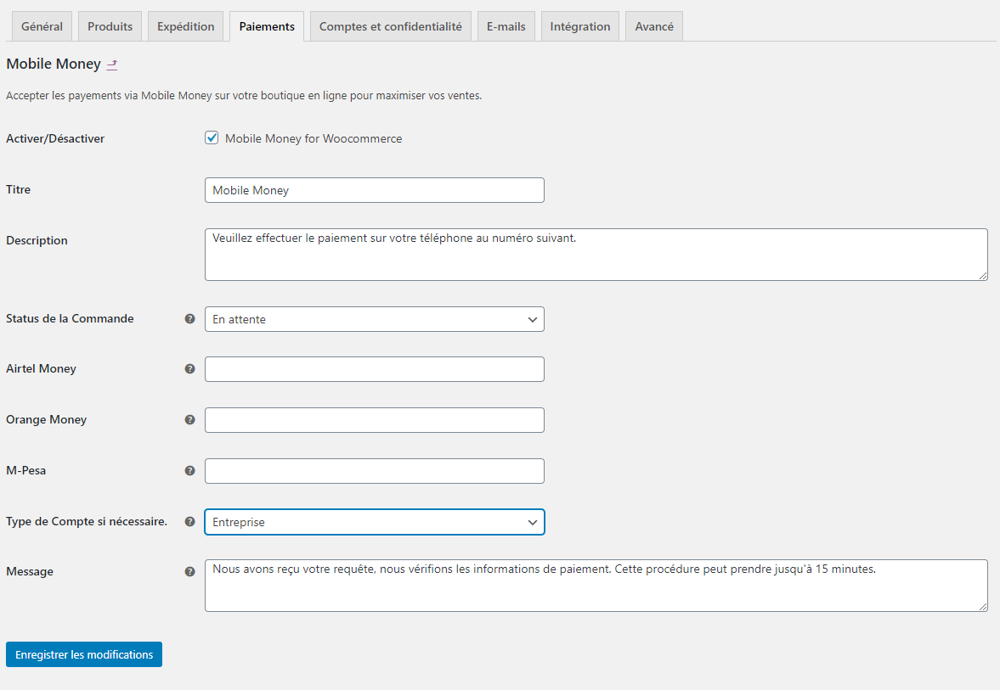

# Mobile Money For Woocommerce
Cette extension ajoute une nouvelle passerelle de paiement pour WooCommerce en acceptant les paiements via Mobile Money dans les pays où les opérateurs mobiles ne disposent pas d'API pour le service de Mobile Money.

## Introduction

Les instructions ci-dessous vous guideront pour la contribution dans le développement de ce Plugin et/ou à déployer ce plugin sur votre boutique en ligne sous WordPress et utilisant WooCommerce afin de commencer à accepter les paiements Mobile Money.

## Captures

#### Activation du Plugin dans Woocommerce

#### Configuration du Plugin

### Prérequis

Si vous êtes l'utilisateur final, vous n'avez peut-être pas besoin de beaucoup de choses, cependant vous aurez besoin:

* D'une boutique en ligne ou en local fonctionnant sur WooCommerce

Pour les contributeurs, vous aurez besoin de quelques connaissances techniques et quelques outils de développement:

* Un IDE ou un Editeur de code
* Une connaissance basique en Git et GitHub

### Cloner et Installer

- Cliquez simplement sur le bouton ``Clone and Download`` ensuite ``Download ZIP`` 
- Après téléchargement, installez le plugin dans WordPress (rassurez-vous que Woocommerce est installé sur votre boutique avant d'installer ce plugin)

## Contribuer sur ce projet

Si vous souhaitez contribuer à un projet et l'améliorer, votre aide est la bienvenue. Contribuer est également un excellent moyen d'en savoir plus sur le codage social sur Github, les nouvelles technologies et leurs écosystèmes et comment faire des rapports de bogues constructifs et utiles, des demandes de fonctionnalités et la plus noble de toutes les contributions: une bonne demande de tirage net.

### Comment faire une Pull Request

- Créez un fork personnel de ce projet.
- Clonez le fork sur votre machine locale. Votre repertoire distant sur Github s'appelle ``origin``.
- Ajoutez le répertoire original en tant que ``upstream``
- Si vous avez créé votre fork il y a longtemps, assurez-vous de faire un ``pull upstream`` sur votre repo local.
- Vous pouvez créer une nouvelle branche pour travailler en local!
- Implémentez et/ou corrigez le code en y ajoutant votre fonctionnalité, sans oublier de commenter votre code.
- Testez votre code
- Faites un ``push`` de vos modifications dans votre fork sur Github.
- Depuis votre fork, ouvrez une ``pull request`` dans la branche ``master``.
- Nous allons approuvé votre demande si elle est utile pour la communauté.

Enfin et surtout: écrivez toujours vos messages de commit en rapport avec les modifications apportées 

## Version

- 1.1

## Auteur & Contributeurs

* **Félix Maroy** - *Initiateur du Projet* - [feljor](https://github.com/feljor)

Voir également la liste des [contributeurs](https://github.com/MerciPro-Inc/Mobile_Money_For_WooCommerce/contributors) qui ont participés dans ce projet.

## Licence

Ce projet est protégé par la licence MIT - en savoir plus ici [LICENSE.md](LICENSE.md)

